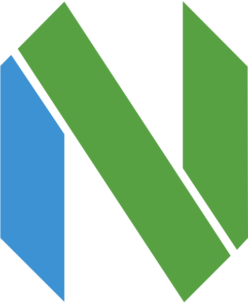

[!TheH1000](https://github.com/TheH1000)

<h1 align="center">Hi there, I'm Kendry - TheH1000 </h1>

<table align="right">
<tr>
<td>

</td>
</tr>
</table>

  
:zap: About me!

### 🔬 FrontEnd Programmer 💻!!
- 🎤 I love Music!
- 🤓  I’m currently learning everything
- 👾  JavaScript is my favorite programming language
- 🗒  I am currently very obsected with learning c#, c++ and .net forms

 

---

<h3 align="center"> Latest Projects</h3>

<tr>
<td>

[][neovim]

</td>
<td> <h4 align="left"> <a href="https://neovim.io/" target="_blank"><code>My Code Editor</code></a> </h4>
  

    
see more...

    NeoVim Is My Favorite Code Editor
    
  
 </td>
</tr>
<tr>
<td>

<h3 align="center">My Programming Languages</h3>

    
    
    
    
    
    
    

<h3 align="left"> GitHub Stats</h3>

  <a href="https://github.com/TheH1000">
  
  

[Neovim Config]: https://github.com/TheH1000/neovim-config-windows
[My Gist]: https://gist.github.com/TheH1000
